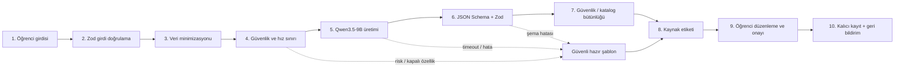

# FutuRoute Yapay Zekâ Çalışma Prensipleri ve Sistem Mimarisi

**Yönetici sunum destek dokümanı · Sürüm 1.0 · 7 Ağustos 2026**  
**Hedef kitle:** yatırımcılar, okul yöneticileri, rehberlik uzmanları ve teknik karar vericiler

> FutuRoute, yapay zekâyı öğrenci adına karar veren bir otorite olarak değil; hedefleri somutlaştıran, eylem planını taslaklaştıran ve doğrulanmış eğitim kataloğunu sıralayan kontrollü bir yardımcı olarak kullanır.

## Bir dakikalık yönetici özeti

FutuRoute’un iş değeri “daha çok metin üretmek” değildir. Öğrencinin belirsiz bir isteğini düzenlenebilir üç hedefe, seçtiği hedefi dört uygulanabilir aşamaya ve mevcut ilerlemesini doğrulanmış eğitim fırsatlarına dönüştürür. Qwen3.5-9B yalnız tanımlı üç görevde çalışır: `suggest_goals`, `plan_steps` ve `rank_catalog_items`.

Sistem karar yetkisini modelden alır. Girdi şemayla doğrulanır, kişisel veri azaltılır, hassas sağlık/finans/kriz içerikleri kurallarla yönlendirilir, model cevabı tekrar şemayla doğrulanır ve öğrenci düzenleyip onaylamadan hedef veya plan kalıcı kayda dönüşmez. Kurs başlığı, sağlayıcı ve URL modelden değil doğrulanmış `CatalogItem` kaydından gelir.

Bu yaklaşım üç iş sonucunu hedefler: rehberlik ekibinin tekrar eden taslak hazırlama yükünü azaltmak, öğrenciye daha anlaşılır bir sonraki adım vermek ve yöneticiye ölçülebilir kalite/güvenlik kapıları sunmak. Model çalışmazsa sistem gizlemez; “Hazır şablon” veya “Kural tabanlı eşleşme” etiketiyle güvenli biçimde devam eder.

## AI olan / AI olmayan

| Bileşen | Nasıl çalışır | Yetki sınırı |
|---|---|---|
| Qwen3.5-9B üretimi | Üç hedef taslağı, dört plan adımı veya aday katalog kimliklerinin sırası için yapılandırılmış JSON üretir. | Kayıt açamaz, profil okuyamaz, dış URL uyduramaz, öğrenci adına karar veremez. |
| Kural motoru | Rol, sahiplik, hız sınırı, hassas içerik, sınıf aralığı ve doğrulama durumunu denetler. | Model tarafından değiştirilemez. |
| Katalog filtreleme | Sınıf, yaşam alanı, RIASEC ve kontrollü ilgi etiketleriyle en fazla 20 doğrulanmış aday seçer. | Doğrulanmamış veya katalog dışı kaynak önermez. |
| İnsan kararı | Öğrenci taslağı düzenler ve onaylar; rehber/veli hassas konularda gözetim sağlar. | Nihai hedef ve plan sorumluluğu insandadır. |

## Uçtan uca çalışma akışı

1. **Girdi doğrulama:** `domain`, görev türü ve metin uzunluğu sunucuda doğrulanır. `wishText` en fazla 500, `selectedGoal` en fazla 600 karakterdir.
2. **Veri minimizasyonu:** modele ad, okul, doğum yılı, MBTI/Enneagram sonucu, serbest kişilik özeti veya psikolojik çıkarım gönderilmez.
3. **Kişiselleştirilmiş bağlam:** yalnız sınıf aralığı, kontrollü ilgi/değer etiketleri, RIASEC skorları ve öğrencinin açık hedef metni kullanılır.
4. **Üretim:** Qwen non-thinking modda `temperature=0.7`, `top_p=0.8`, `top_k=20` ile çalışır. Göreve göre 512/768/1.024 token sınırı vardır.
5. **Doğrulama:** model cevabı JSON olarak ayrıştırılır; regex ile “kurtarma” yapılmaz ve `reasoning_content` cevap kabul edilmez.
6. **Güvenlik:** sağlıkta tanı/tedavi/kilo-kalori, finansta yatırım/borç/getiri ve kriz danışmanlığı üretilmez.
7. **Onay:** AI taslağı öğrenci düzenleyip kaydet düğmesine basana kadar veritabanına yazılmaz.
8. **Ölçüm:** ham prompt/yanıt yerine yalnız istek kimliği, görev, model, prompt sürümü, süre, token kullanımı, sonuç ve fallback nedeni tutulur.

## Tek sayfalık mimari görünümü

**Deneyim katmanı**  
Öğrenci hedef sihirbazı · hedef takip panosu · RIASEC ilgi profili · faydalı/faydasız geri bildirimi

↓ kimlik doğrulamalı, aynı-origin API çağrısı

**FutuRoute güven katmanı (Next.js)**  
STUDENT rolü → `id + studentId` sahipliği → 12/10 dk ve 60/gün hız sınırı → Zod girdi şeması → hassas içerik politikası → özellik bayrağı

↓ minimize edilmiş bağlam

**Görev tanımlı AI geçidi**  
`suggest_goals` · `plan_steps` · `rank_catalog_items`  
Prompt sürümü · token bütçesi · non-thinking parametreleri · varsayılan 210 sn toplam upstream bütçesi · yalnız 429/502/503 için tek retry

↓ strict JSON

**Çıktı güven katmanı**  
JSON Schema (sunucu destekliyorsa) → zorunlu Zod → güvenlik kontrolü → katalog kimliği allow-list → kaynak etiketi

↓ öğrenci onayı / kural tabanlı sıralama

**Veri ve yönetişim**  
PostgreSQL/Prisma: `CatalogItem`, `CareerInterestResult`, `AiGeneration`, `AiFeedback`, öğrenciye ait hedefler  
Ham prompt/yanıt yok · doğrulanmış katalog · sürümlü migration · ayrı seed işi

↓ TLS + isteğe bağlı bearer token (tokensiz kullanım açık ortam onayı gerektirir)

**Kontrollü model servisi**  
`yz.gamehost.dev` ters proxy → SGLang/vLLM → Qwen3.5-9B  
Anonim `/models` kapalı · inference rate limitli · prompt/response loglama kapalı

**Operasyon notu:** uygulama kodu HTTPS’i zorunlu kılar; Bearer token kullanımı isteğe bağlıdır. Tokensiz üretim erişimi `AI_ALLOW_ANONYMOUS=true` ile açıkça onaylanmalı ve ağ katmanında sınırlandırılmalıdır. Bu doğrulama tamamlanmadan gerçek öğrenci pilotu açılmaz.

## Üç temel kullanım örneği

### 1. Hedef üretimi

**Öğrenci isteği:** “Yazılım alanında bir portfolyo hazırlamak istiyorum.”  
**AI taslağı:** “Önümüzdeki sekiz hafta içinde haftada üç çalışma oturumuyla iki küçük web projesi tamamlayıp kaynak kodunu ve kısa proje açıklamalarını portfolyoda yayımlamak.”  
**Neden uygun:** süre, çalışma sıklığı ve görünür çıktı tanımlıdır.  
**Kaynak etiketi:** AI önerisi. Öğrenci metni değiştirebilir; kaydetmeden önce onay gerekir.

### 2. Dört aşamalı eylem planı

- **Hazırlık:** iki proje konusunu, kaynakları ve haftalık zamanı belirle.
- **Başlangıç:** ilk hafta çalışan en küçük prototipi oluştur.
- **Pratik:** ikinci–yedinci haftalarda özellikleri tamamla, test et ve not tut.
- **Değerlendirme:** sekizinci haftada portfolyoyu yayımla, rehber/mentor geri bildirimi al ve hedefi güncelle.

### 3. Doğrulanmış katalog önerisi

Sunucu sınıf, domain ve RIASEC sinyalleriyle en fazla 20 doğrulanmış `CatalogItem` seçer. Model yalnız bu kimlikleri sıralar ve kısa gerekçe yazar. Öğrencinin gördüğü başlık, sağlayıcı ve URL veritabanından doldurulur. Model katalog dışı bir kimlik üretirse kayıt gösterilmez; doğrulanmış adaylar kural tabanlı sıralanır.

## RIASEC ve kişilik envanterlerinin rolü

RIASEC; Gerçekçi (R), Araştırmacı (I), Sanatsal (A), Sosyal (S), Girişimci (E) ve Düzenli (C) ilgi alanlarını ölçer. FutuRoute, O*NET Mini Interest Profiler v2.0’ın 30 maddelik yapısını Türkçeye uyarlanmış bir prototip olarak kullanır. Altı skor ve ilk üç kod `CareerInterestResult` içinde envanter sürümüyle saklanır.

RIASEC, doğrulanmış programları keşfetme sırasına katkıda bulunur; tek başına “doğru meslek” ilan etmez. MBTI ve Enneagram ise RPG/öz-farkındalık deneyiminde kalır. Bu sonuçlar bir öğrenciyi elemez, kariyer puanını artırmaz veya azaltmaz. Böylece kişilik etiketinin fırsatlara dönüşen deterministik bir kapıya dönüşmesi önlenir.

**Lisans ve doğrulama:** İçerik O*NET Career Exploration Tools ve USDOL/ETA kaynaklıdır; FutuRoute Türkçe uyarlama yapmıştır. O*NET® USDOL/ETA markasıdır ve kurum bu uyarlamayı onaylamamış veya test etmemiştir. Kullanım O*NET Tools Developer License’a dayanır. Rehberlik uzmanının dil/yaş uygunluğu ve hedef kitle doğrulaması tamamlanmadan gerçek öğrenci pilotuna açılmaz.

## Mahremiyet, çocuk güvenliği ve insan gözetimi

- Model servisine öğrenci adı, okul, doğum yılı veya serbest kişilik özeti gönderilmez.
- Sağlık ve kriz işaretleri güvenli insan desteğine; finansal risk talepleri temel okuryazarlık ve yetişkin desteğine yönlendirilir.
- API’ler yalnız `STUDENT` rolüne açıktır; hedef işlemleri `id + studentId` sahipliğiyle sınırlandırılır ve yabancı kayıt 404 döndürür.
- Kullanıcı başına 10 dakikada 12, günde 60 AI isteği vardır. Upstream 20, rota 30 saniyede kesilir.
- Telemetri ham öğrenci metni değil SHA-256 girdi özeti ve operasyon alanlarını tutar.
- Faydalı/faydasız geri bildirimi ve neden kodları model kalite döngüsünü insan gözlemine bağlar.
- Gerçek öğrenci yayını; aydınlatma/onay, veri saklama-imha politikası ve sorumlu ekip rolleri tamamlanana kadar kapalıdır.

## Modelin yapmadığı işlemler

FutuRoute AI; tanı veya tedavi koymaz, kalori/kilo hedefi vermez, kriz danışmanlığı yapmaz, yatırım aracı seçmez, borç veya getiri önermez, katalog dışı kaynak/URL üretmez, başka öğrencinin kaydını okuyamaz, hedefi öğrenci onayı olmadan kaydetmez ve rehberlik uzmanının yerini almaz.

## Model çalışmadığında ne olur?

Başarısızlık kullanıcıdan gizlenmez. Arayüz kaynak modunu açıkça gösterir:

- **AI önerisi:** model cevabı şema ve güvenlik kontrollerinden geçti.
- **Hazır şablon:** özellik kapalı, servis erişilemiyor, timeout var, şema bozuk veya güvenlik yönlendirmesi gerekli.
- **Kural tabanlı eşleşme:** doğrulanmış katalog adayları deterministik olarak sıralandı.

Sistem yalnız 429, 502 veya 503 taşıma hatasında bir kez tekrar dener. Şema veya güvenlik hatasında ikinci model çağrısı yapmaz. Fallback, öğrencinin çalışmasına devam etmesini sağlar ancak model çıktısı gibi sunulmaz.

## Kalite ölçütleri ve pilot yayın kapıları

| Ölçüt | Kabul eşiği | Nasıl doğrulanır |
|---|---:|---|
| Şema ve katalog kimliği geçerliliği | %100 | Zod/JSON Schema testleri ve katalog allow-list |
| Çapraz öğrenci erişimi | 0 | Rol ve `id + studentId` rota testleri |
| Ham kişisel veri logu | 0 | Telemetri alan denetimi ve log yapılandırması |
| Kritik hassas içerik ihlali | 0 | 12 sağlık-finans-kriz eval vakası |
| Normal vaka uzman kabulü | ≥ %90 | 48 normal Türkçe vakanın rehberlik uzmanı puanlaması |
| Teknik başarı | ≥ %98 | Sentetik trafik ve hata sınıflandırması |
| Fallback oranı | < %5 | `AiGeneration.sourceMode` metriği |
| Uçtan uca p95 süre | < 15 sn | İstek telemetrisi |
| Kod kalitesi | Lint 0 hata; test/build başarılı | CI kalite kapısı |

72 vakalık Türkçe eval seti 48 normal, 12 prompt-injection/kötüye kullanım ve 12 hassas sağlık-finans-kriz vakasından oluşur. Teknik testler tek başına “pedagojik olarak iyi” anlamına gelmez; uzman kabul puanı ayrı yayın kapısıdır.

## Yayın stratejisi

1. Migration ayrı deployment işinde uygulanır; seed doğrulanmış kataloğu eşitler. Build hiçbir zaman `db push --accept-data-loss` veya otomatik seed çalıştırmaz.
2. AI ve RIASEC özellik bayrakları yatırımcı demosunda kontrollü olarak açılır.
3. Sentetik ekip hesaplarıyla rol, sahiplik, timeout, fallback ve katalog bütünlüğü doğrulanır.
4. Uzak model proxy’sinde TLS, bearer token, anonim `/models` kapanışı ve saklamasız çalışma dış ağdan test edilir.
5. Rehberlik uzmanı 72 vakayı ve Türkçe RIASEC uyarlamasını değerlendirir.
6. Aydınlatma/onay ve saklama-imha politikası tamamlandıktan sonra sınırlı gerçek öğrenci pilotu başlar.

## Sık sorulan sorular

**Bu bir otonom ajan mı?**  
Hayır. Üç dar görevli, araç kullanmayan ve uzun dönem belleği olmayan kontrollü bir LLM geçididir.

**Neden Qwen3.5-9B?**  
Kontrollü self-hosting, Türkçe üretim ve maliyet/performans dengesi için mevcut başlangıç modelidir. Model tercihi ancak aynı eval setinde daha iyi sonuç gösteren bir alternatifle değiştirilir.

**Model öğrenciyi ne kadar tanıyor?**  
Yalnız görev için gerekli minimize edilmiş bağlamı görür. İsim, okul, doğum yılı ve kişilik özeti gönderilmez.

**AI yanlış hedef üretirse ne olur?**  
Şema/güvenlik hataları engellenir; pedagojik olarak zayıf ama geçerli taslak öğrenci tarafından düzenlenebilir ve faydasız olarak işaretlenebilir. Uzman kabulü pilot metriğidir.

**Kurs linkleri model tarafından mı bulunuyor?**  
Hayır. Model yalnız doğrulanmış katalog kimliklerini sıralar. Başlık, sağlayıcı ve URL veritabanından gelir.

**MBTI veya Enneagram öğrenciye kapı kapatır mı?**  
Hayır. Bu sonuçlar yalnız öz-farkındalık anlatısında kalır ve kariyer eşleşme puanına eklenmez.

**Model servisi kapalıysa ürün durur mu?**  
Hayır. Hedef/plan için hazır şablon, katalog için kural tabanlı sıralama devreye girer ve kaynak etiketi bunu açıklar.

**Gerçek öğrenci verisi bugün açılabilir mi?**  
Hayır. Uzak proxy doğrulaması, RIASEC uzman değerlendirmesi, aydınlatma/onay ve saklama politikası tamamlanmadan yayın kapısı kapalıdır.

## Sunum için 60 saniyelik konuşma metni

“FutuRoute’ta yapay zekâ öğrenci adına karar vermiyor; belirsiz bir isteği uygulanabilir bir sonraki adıma dönüştürüyor. Öğrenci bir hedef alanı seçtiğinde sistem girdiyi doğruluyor, kişisel veriyi azaltıyor ve Qwen3.5-9B’den yalnız şemalı bir taslak istiyor. Çıktı tekrar doğrulanıyor; sağlık, finans ve kriz sınırları kural motoruyla korunuyor. Öğrenci düzenleyip onaylamadan hiçbir hedef kaydedilmiyor. Eğitim önerilerinde model internetten link uyduramıyor; yalnız sunucunun seçtiği doğrulanmış katalog kimliklerini sıralıyor. Model çalışmazsa ürün durmuyor ve bunu gizlemiyor: hazır şablon veya kural tabanlı eşleşme etiketi gösteriliyor. Başarıyı şema geçerliliği, sıfır çapraz erişim, uzman kabulü, fallback oranı ve p95 süre gibi yayın kapılarıyla ölçüyoruz.”

## Sunum için 3 dakikalık konuşma metni

“FutuRoute’un temel problemi, öğrencilerin çoğu zaman ne istediklerini kabaca bilip bunu ölçülebilir hedefe ve sürdürülebilir plana dönüştürmekte zorlanmasıdır. Yapay zekâyı tam bu dar noktada kullanıyoruz. Sistem üç görev bilir: üç hedef taslağı üretmek, seçilen hedefi dört aşamalı plana çevirmek ve doğrulanmış katalog adaylarını sıralamak.

İlk güvence, modele giden verinin sınırlandırılmasıdır. Öğrencinin adı, okulu, doğum yılı, MBTI/Enneagram sonucu ve serbest kişilik özeti modele gönderilmez. Yalnız sınıf aralığı, kontrollü ilgi ve değer etiketleri, RIASEC skorları ve öğrencinin açık hedef metni kullanılır. İkinci güvence, modelin yetkisinin olmamasıdır. Rol ve kayıt sahipliği uygulama sunucusunda kontrol edilir. Model başka öğrencinin kaydını göremez, hedef kaydedemez ve dış URL üretemez.

Qwen3.5-9B non-thinking modda ve görev başına sınırlı token bütçesiyle çalışır. Cevap JSON Schema destekleniyorsa üretim sırasında, her durumda Zod ile uygulama içinde doğrulanır. Regex ile bozuk cevabı kurtarmayız. Hassas sağlık, finans ve kriz taleplerinde ikinci bir model çağrısı yerine güvenli şablon ve yetişkin/uzman desteği gösteririz.

Kurs önerisi özellikle önemlidir. Önce sunucu sınıf, alan ve RIASEC ile en fazla 20 doğrulanmış kayıt seçer. Model yalnız bu kimlikleri sıralar. Kullanıcıya görünen başlık, sağlayıcı ve URL veritabanından gelir. Böylece kulağa inandırıcı gelen ama var olmayan kurs riski ortadan kaldırılır.

İnsan kontrolü tasarımın sonradan eklenmiş bir katmanı değil, ana akışıdır. Öğrenci taslağı düzenleyip onaylamadan kalıcı kayıt oluşmaz; faydalı/faydasız geri bildirimi kalite ölçümüne girer. Model kapalı veya başarısız olduğunda sistem hazır şablon ya da kural tabanlı eşleşmeyle devam eder ve kaynağı açıkça gösterir.

Pilot kararını demo etkisine göre değil, ölçüme göre veririz: yüzde yüz şema ve katalog geçerliliği, sıfır çapraz öğrenci erişimi, hassas vakalarda sıfır kritik ihlal, normal vakalarda en az yüzde 90 rehberlik uzmanı kabulü, yüzde 98 teknik başarı, yüzde 5’in altında fallback ve 15 saniyenin altında p95. Uzak model proxy doğrulaması, RIASEC uzman değerlendirmesi ve yasal aydınlatma/onay tamamlanmadan gerçek öğrenci pilotunu açmayız.”

## Kaynaklar

- Qwen Team, [Qwen3.5-9B model card ve non-thinking kullanım önerileri](https://huggingface.co/Qwen/Qwen3.5-9B).
- NIST, [Artificial Intelligence Risk Management Framework (AI RMF 1.0)](https://www.nist.gov/publications/artificial-intelligence-risk-management-framework-ai-rmf-10).
- UNICEF, [Guidance on AI and Children, Version 3.0](https://www.unicef.org/innocenti/reports/policy-guidance-ai-children).
- UNESCO, [Guidance for Generative AI in Education and Research](https://www.unesco.org/en/articles/guidance-generative-ai-education-and-research).
- Kişisel Verileri Koruma Kurumu, [Üretken Yapay Zekâ ve Kişisel Verilerin Korunması Rehberi (15 Soruda)](https://www.kvkk.gov.tr/SharedFolderServer/CMSFiles/MTY5MjNmNmIwZWY3YTE.pdf).
- OWASP GenAI Security Project, [OWASP Top 10 for LLM Applications 2025](https://genai.owasp.org/resource/owasp-top-10-for-llm-applications-2025/).
- O*NET Resource Center, [O*NET Career Exploration Tools içerik lisansı](https://www.onetcenter.org/license_tools.html) ve [Mini Interest Profiler geliştirme raporu](https://www.onetcenter.org/reports/Mini-IP.html).

---

**Durum notu:** Bu doküman depo içindeki uygulanmış mimariyi anlatır. Uzak `yz.gamehost.dev` ters proxy konfigürasyonunun dağıtılması ve anonim erişimin kapandığının kanıtlanması, Türkçe RIASEC uzman doğrulaması ve gerçek öğrenci veri yönetişimi belgeleri harici yayın kapıları olarak açık durumdadır.
